# ServicePros Information Architecture Blueprint

Date: 2026-08-05
Skills used: seo-structure-architect, seo-programmatic, seo-snippet-hunter

## Architecture Goal

ServicePros should organize SEO traffic around four clear silos:

1. Find providers
2. Book services
3. Grow as a provider
4. Trust, verification, and marketplace education

This keeps navigation understandable for users and makes page relationships clearer for search engines and answer engines.

## Silo Map

```mermaid
graph TD
  Home["/ - Service Providers South Africa"]
  Find["Find providers"]
  Book["Book services"]
  Grow["Grow as a provider"]
  Trust["Trust and marketplace education"]

  Home --> Find
  Home --> Book
  Home --> Grow
  Home --> Trust

  Find --> Search["/search"]
  Find --> Category["/providers/category/[slug]"]
  Find --> Location["/providers/in/[location]"]
  Find --> CategoryCity["/providers/category/[slug]/in/[location]"]
  Find --> TopRated["/providers/top-rated/[location]"]
  Find --> Profile["/providers/[slug]"]

  Book --> Services["/services"]
  Book --> ServiceDetail["/services/[id]"]
  Book --> Pricing["/pricing"]
  Book --> Refund["/refund"]
  Book --> Delivery["/delivery"]

  Grow --> GetListed["/get-listed"]
  Grow --> Why["/why-servicepros"]
  Grow --> ProviderTerms["/provider-terms"]
  Grow --> Partners["/platform-partners"]
  Grow --> Referrals["/referral-agents"]

  Trust --> Verification["/verification"]
  Trust --> About["/about"]
  Trust --> DPM["/dpm"]
  Trust --> Help["/help"]
  Trust --> Contact["/contact"]
  Trust --> Terms["/terms"]
  Trust --> Privacy["/privacy"]
```



## Header Blueprints

### Home

```txt
H1: Find trusted service providers in South Africa
H2: Browse by category
H2: Browse by region
H2: Businesses worth a closer look
H2: Services worth booking
H2: Why customers use ServicePros
```

Add near-top definition block:

```txt
ServicePros is a South African marketplace for finding, comparing, and booking local service providers.
```

### Category page

```txt
H1: {Category} providers in South Africa
H2: Compare {category} providers
H2: Common {category} services
H2: How to choose a {category} provider
H2: Browse {category} providers by city
H2: Related service categories
```

### Location page

```txt
H1: Service providers in {City}
H2: Browse providers in {City}
H2: Popular services in {City}
H2: How to compare local providers
H2: Browse {City} providers by category
H2: Nearby service areas
```

### Category-location page

```txt
H1: {Category} providers in {City}
H2: Compare {category} providers in {city}
H2: Common {category} services in {city}
H2: What to check before booking
H2: Verified providers and reviews
H2: Related searches
```

### Service detail page

```txt
H1: {Service title}
H2: About this service
H2: Packages and pricing
H2: About the provider
H2: Reviews
H2: Before you book
H2: Related services
```

### Pricing

```txt
H1: Pay for services with credits
H2: What is a ServicePros credit?
H2: Credit packs
H2: How credits work
H2: Refunds and returned credits
H2: Frequently asked questions
```

### Get listed

```txt
H1: Get listed as a South African service provider
H2: How to get listed
H2: Everything you get
H2: No pay-per-lead fees
H2: Boost trust with verified badges
H2: Built for every kind of business
H2: Ready to get found?
```

### DPM

```txt
H1: DPM: Directory and Provider Marketplace
H2: What is a DPM?
H2: Why the category needed a name
H2: The three parts of the name
H3: Directory - being findable
H3: Provider - the business itself
H3: Marketplace - the transaction
H2: Where the name comes from
H2: DPM in practice
```

## Internal Linking Matrix

| From | Link to | Anchor examples | Reason |
| --- | --- | --- | --- |
| `/` | `/search` | `find providers near you` | Main discovery path. |
| `/` | `/services` | `browse bookable services` | Transaction path. |
| `/` | `/get-listed` | `get listed as a provider` | Provider acquisition. |
| `/` | `/verification` | `how verification works` | Trust support. |
| `/dpm` | `/about` | `how ServicePros uses the DPM model` | Entity/context connection. |
| `/dpm` | `/platform-partners` | `platform partners in the DPM ecosystem` | Marketplace extension. |
| `/pricing` | `/how-it-works` | `how bookings work` | Customer onboarding. |
| `/pricing` | `/refund` | `credit refund rules` | Payment trust. |
| `/get-listed` | `/why-servicepros` | `why ServicePros does not charge per lead` | Provider conversion. |
| `/get-listed` | `/provider-terms` | `provider terms` | Legal clarity. |
| `/verification` | `/providers/[slug]` | `verified provider profiles` | Show the concept in use. |
| Category pages | Location combinations | `{category} providers in {city}` | Long-tail discovery. |
| Location pages | Category combinations | `{category} providers in {city}` | Long-tail discovery. |
| Provider profiles | Category/city/service pages | `{category} providers`, `{city} providers` | Contextual discovery. |
| Service detail | Provider profile | `{provider name}` | Entity ownership. |
| Service detail | `/pricing` | `how credits work` | Checkout confidence. |

## Breadcrumb Plan

Use `BreadcrumbList` on:

- Home > Providers > Category
- Home > Providers > City
- Home > Providers > Category > City
- Home > Providers > Provider name
- Home > Services > Service name
- Home > Pricing
- Home > Trust > Verification
- Home > About > DPM

Example:

```json
{
  "@context": "https://schema.org",
  "@type": "BreadcrumbList",
  "itemListElement": [
    { "@type": "ListItem", "position": 1, "name": "Home", "item": "https://servicepros.co.za" },
    { "@type": "ListItem", "position": 2, "name": "Providers", "item": "https://servicepros.co.za/search" },
    { "@type": "ListItem", "position": 3, "name": "Electricians in Cape Town", "item": "https://servicepros.co.za/providers/category/electricians/in/cape-town" }
  ]
}
```

## Table of Contents Strategy

Add compact jump links to long-form pages only:

- `/dpm`
- `/how-it-works`
- `/verification`
- `/pricing`
- `/why-servicepros`
- `/provider-terms`
- future category guides

Do not add table of contents to short marketplace listing pages where it adds friction.

## Sitemap Priorities

| Route family | Priority |
| --- | ---: |
| Home | 1.0 |
| Search/services hubs | 0.8-0.9 |
| Provider profiles | 0.8 |
| Service detail pages | 0.8 |
| Category-city pages that pass gates | 0.75 |
| Category/location pages | 0.7 |
| Provider acquisition pages | 0.7-0.8 |
| Trust explainers | 0.5-0.7 |
| Legal/policy pages | 0.2-0.4 or noindex depending strategy |

## Structural Backlog

1. Add breadcrumb schema helper and visual breadcrumb consistency.
2. Add page-level SEO intro blocks to programmatic templates.
3. Add inventory-aware related link components.
4. Add jump links for longer explainers.
5. Use route-grouped sitemap priorities.
6. Keep only one H1 per page; current scan suggests the public page templates are mostly aligned.

